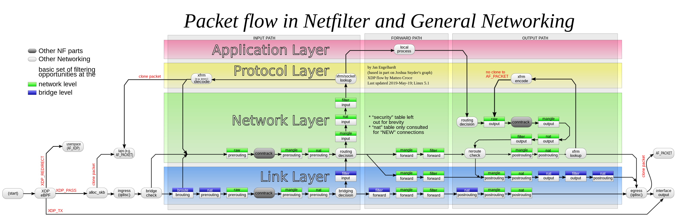

# 前言
    尽管许多文章介绍了目前k8s网络的构建，和k8s网络的模型，但是对于整个网络模型以及框架介绍的比较少。本篇文章脱离某一个网络的介绍。从容器和网络出发，详细剖析容器的构成，网络的构建

# 容器

  容器如何实现网络隔离的？linux 容器有两大基石构建容器。一是linux cgroup，cgroup决定容器的资源分配。二是linux namespace。
linux 的namespace 分为mount/network/pid namespace等。linux的容器本质上对一组进程的约束。cgroup和namespace都可以看作是进程的某一个属性。容器内的进程，具有相同的cgroup和相同的namespace。
实现网络隔离的核心是net namespace。注意不同的namepsace实现的方式不一样。在主机上可以看到容器内的进程。但是在主机上无法看到容器的网络（严谨的说法是主机上的进程无法看到容器进程的网络）。
 
net namespace 主要隔离以下内容。
* Linux 网络设备：包含veth，vxlan等
* Linux 协议栈：包含netfilter框架等
* Linux 路由(个人觉的路由属于协议栈)

# linux网络

> 很多我们熟知的网络vpn实际上内部并不实现 包转发 这些相关逻辑，这些vpn会直接使用linux现有的技术实现 vpn的转发。

## linux网络组件

* Linux 网络设备
* Linux 协议栈
* Linux 路由
* Linux 内核模块和ebpf

> net namespace不隔离内核模块和ebpf。因为他们不是进程。

### Linux网络设备

Linux网络设备分为物理设备和虚拟设备，只有物理设备能提供和其他节点的通信功能。例如 pod的packet转发到另一个节点的pod，必须经过物理网卡。
虚拟网络设备用来帮助构建负责的linux网络。下面是几个虚拟网络设备的示例

* vxlan：作用于2层。将packet封装一层vxlan头，将packet转发给另一个vxlan设备，另一个vxlan解出原始packet。
* veth：作用于2层。veth是一对设备，从一个veth网卡进去的packet从另一个网卡出来
* bridge：虚拟2层交换机
* 其他网络设备：https://developers.redhat.com/blog/2018/10/22/introduction-to-linux-interfaces-for-virtual-networking

### Linux网络协议栈

Linux的packet在内核解析中会被网络协议栈层层解析。网络7层模型，前4层在内核协议栈解析，后3层在应用解析。
linux在协议栈设置netfilter网络框架，其用户命令为iptables。利用iptables，我们可以实现在网络层和链路层做一些丢包，该ip等行为。
``

### Linux路由

Linux路由也属于linux协议栈一部分，从上面的netfilter图看到，Linux路由作用于网络层。
Linux路由的作用是决定*包的下一跳转发给谁（这里的谁使用ip表示）*。
例如在任何一个初始化完eth0的Linux系统中，都会有一个默认路由。该路由表示所有的包默认交给网关（如果没有这个路由，任何的packet都发不出去）

在linux系统中，只有从网卡出来的packet 会查询路由。

# k8s容器网络方案

## underlay 网络

* pod使用物理网卡
pod使用物理网卡或者物理网卡分身，建议pod和节点属于同一个网段。其特征：packet直接从pod到另一个pod，无需经过主机协议栈。
这种组网方式和普通的节点组网方式一样。缺点是

## overlay 网络

在节点网络上构建一个新的网络，该网络网段和节点网络不一样。overlay网络的组网方式分为隧道网络，路由网络
overlay 网络需要先解决一个问题
1. packet 网络从容器到达主机

解决方法使用veth设备，veth设备的一端挂到主机上，veth设备的另一端挂到容器里面（命名为eth0）。发送给容器的eth0的包都会从主机的veth设备出来
节点内部的pod到pod网络，不经过eth0设备。使用bridge（虚拟交换机）或者使用路由，将packet的包从主机的一个veth发送给另一个veth设备。
节点之间的pod到pod网络，需要经过eth0设备，由于节点网络无法转发pod地址的packet，因此再次经过处理。一般情况下使用隧道网络或者路由网络

### 隧道网络

使用vxlan或者tun，可以将ip封装一层，外面一层的源 ip和目标ip 是两个节点的物理网卡ip。

```
pod1 ---> vxlan -> eth0 ------>eth0 -> vxlan ----> pod2
                  node1      node2
```
1. vxlan是2层封装，会mac地址封装。tun是3层封装，只封装ip层。
2. 隧道模式性能比较差。但是隧道模式对主机网络要求较低。

### 路由网络

通过3层的linux 路由表，将包一跳一跳的发送给目标pod。
```
pod1 --> eth0 --> route --> eth0 ---> pod2
        node1     路由器    node2
```
路由的路径
1. packet到达eth0之后，根据本机路由查询，将包发送给route（路由器）。
2. 路由器在接收到包之后，在查询路由器的路由表，将包发送给对方eth0。
3. 对方的eth0收到包之后，查询路由，将包交给pod2

路由优缺点
1. 性能较高，无封装。单位能发送的数据更多
2. 对主机环境要求高，必须有外部的路由支持。

## service 网络

在packet egress中，service通过主机上的iptables修改，将serice地址改为相关的pod地址。
